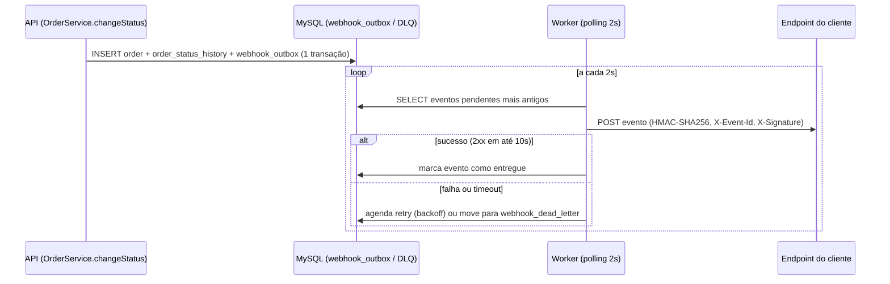

# RFC: Sistema de Webhooks de Notificação de Pedidos

## Metadados

- Autor: Larissa (Tech Lead) — proposta consolidada a partir da reunião técnica registrada em `TRANSCRICAO.md`
- Status: Em Revisão
- Data: 2026-07-19
- Revisores: Marcos (Product Manager), Bruno (Engenheiro Pleno, Pedidos), Diego (Engenheiro Sênior, Plataforma), Sofia (Engenharia de Segurança)

## Resumo Executivo (TL;DR)

Propomos um sistema de webhooks *outbound* para notificar clientes B2B (Atlas Comercial, MaxDistribuição e Nova Cargo) quando o status de um pedido muda, substituindo o polling atual em `GET /orders` (`[09:00–09:02]`). A entrega usa o padrão Outbox sobre o MySQL já existente — o evento é inserido na mesma transação que já atualiza `orders` e `order_status_history` em `OrderService.changeStatus` — processado de forma assíncrona por um worker separado em polling de 2 segundos, com retry e Dead Letter Queue (DLQ) para falhas persistentes. A entrega é autenticada via HMAC-SHA256 com secret por endpoint e garante *at-least-once* com deduplicação do lado do cliente via `X-Event-Id`. A implementação reaproveita ao máximo os padrões já existentes no projeto (`AppError`, Pino, middleware de erro, estrutura de módulos, `requireRole`). Estimativa: três sprints, incluindo revisão de segurança dedicada. O principal trade-off assumido é abrir mão de garantias fortes (ordering global, entrega síncrona, exactly-once) em troca de simplicidade operacional e reuso de infraestrutura já operada pelo time.

## Contexto e Problema

Três clientes B2B pediram formalmente notificação em tempo real de mudanças de status de pedido; hoje eles fazem polling periódico em `GET /orders`, o que a Atlas já classificou como lento e caro de integrar — com risco explícito de migração para um concorrente até o fim do trimestre caso a feature não seja entregue (`[09:00]`). Para os clientes, "tempo real" significa qualquer latência abaixo de 10 segundos, não um requisito de streaming estrito (`[09:02]`).

A aplicação atual (`src/`) é um Order Management System funcional — módulos de autenticação, usuários, clientes, produtos e pedidos, com máquina de estados de pedido controlada e auditoria de mudanças de status em `OrderStatusHistory` — mas não possui nenhum mecanismo de notificação externa, fila ou webhook (`ANALIZE_CODEBASE.md`). Esse vácuo é o que esta proposta preenche.

A restrição mais relevante levantada na reunião é organizacional, não técnica: o time é pequeno, e qualquer solução que exija nova infraestrutura operacional (por exemplo, um cluster de mensageria dedicado) tem custo desproporcional ao problema (`[09:07]`).

## Proposta Técnica

A proposta se apoia em sete decisões já registradas como ADRs (seção "Decisões Relacionadas"). Em linhas gerais:

1. **Captura do evento (ADR-001).** Quando `OrderService.changeStatus` (`src/modules/orders/order.service.ts`) muda o status de um pedido, a mesma transação Prisma que já atualiza `order` e insere em `order_status_history` também insere uma linha em uma nova tabela `webhook_outbox`. Não há possibilidade de o status mudar sem que o evento correspondente seja registrado, nem vice-versa.
2. **Processamento assíncrono (ADR-002).** Um processo Node separado (`src/worker.ts`, análogo ao `src/server.ts` existente) faz polling na `webhook_outbox` a cada 2 segundos, buscando os eventos pendentes mais antigos e disparando as chamadas HTTP para os endpoints cadastrados pelos clientes.
3. **Resiliência a falhas (ADR-003).** Falhas de entrega são reprocessadas com backoff exponencial (5 tentativas, 1m/5m/30m/2h/12h). Após esgotar as tentativas, o evento vai para uma tabela `webhook_dead_letter`, com reprocessamento manual via endpoint administrativo restrito à role `ADMIN`.
4. **Autenticidade (ADR-004).** Cada requisição de webhook é assinada com HMAC-SHA256 usando uma secret exclusiva por endpoint cadastrado, enviada no header `X-Signature`, com suporte a rotação com grace period de 24 horas.
5. **Semântica de entrega (ADR-005).** A garantia é *at-least-once*; cada evento carrega um `event_id` único no header `X-Event-Id`, e a deduplicação de eventuais duplicatas é responsabilidade do cliente — mesmo padrão adotado por provedores como Stripe e GitHub.
6. **Reuso de padrões do projeto (ADR-006).** O novo módulo `src/modules/webhooks` segue a mesma estrutura (controller/service/repository/routes/schemas) já usada em `src/modules/orders`, e os erros de domínio estendem `AppError` com prefixo `WEBHOOK_*`, capturados pelo middleware de erro já existente (`src/middlewares/error.middleware.ts`) sem nenhuma alteração nele.
7. **Limitação conhecida de ordering (ADR-007).** A ordem de entrega só é garantida por `order_id`, e apenas enquanto houver um único worker ativo.

Na superfície de API, o cliente poderá cadastrar, editar, listar e remover webhooks (com filtro de quais status deseja receber), consultar o histórico das últimas entregas e, no caso de operadores administrativos, reprocessar eventos presos na DLQ. O detalhamento de contratos, payloads e códigos de erro fica para o FDD — esta proposta se limita ao desenho arquitetural.

### Diagrama de alto nível

## Alternativas Consideradas

- **Entrega síncrona dentro de `OrderService.changeStatus`.** Descartada: acoplaria a mudança de status à disponibilidade e latência de um sistema externo, travando outros pedidos em caso de cliente lento, sem possibilidade de rollback se o cliente estivesse fora do ar (`[09:03–09:04]`).
- **Fila externa dedicada (ex.: Redis Streams).** Descartada por representar overengineering para o tamanho atual do time: subir e operar infraestrutura de mensageria nova não se justifica quando o MySQL já existente resolve o problema (`[09:07]`).
- **Notificação reativa via trigger de banco de dados.** Descartada porque o MySQL não tem um mecanismo de listener nativo para processos externos (diferente do `NOTIFY`/`LISTEN` do Postgres); as alternativas para contornar essa limitação foram julgadas frágeis, o que motivou a escolha por polling (`[09:09]`).
- **Garantia de entrega exactly-once.** Descartada por exigir coordenação transacional complexa entre plataforma e cliente, para um ganho marginal frente a at-least-once com deduplicação client-side, que já resolve a vasta maioria dos casos práticos (`[09:25]`).

Cada uma dessas alternativas é detalhada, com trade-off completo, no respectivo ADR referenciado na seção "Decisões Relacionadas".

## Questões em Aberto

- **Rate limiting de saída.** Se um cliente tiver muitos pedidos mudando de status na mesma janela de tempo, a plataforma pode enviar um volume alto de chamadas HTTP a esse cliente em sequência. A equipe decidiu não implementar rate limiting agora, mas observar o comportamento em produção e decidir depois (`[09:38–09:39]`) — sem critério definido de quando isso se tornaria necessário.
- **Nível de permissão do CRUD de configuração de webhook.** Hoje qualquer role autenticada pode cadastrar/editar/remover webhooks; a equipe reconheceu que isso pode precisar ser endurecido no futuro, sem decidir critério ou prazo (`[09:37]`).
- **Notificação ao cliente sobre falhas recorrentes.** Ficou fora do escopo desta fase avisar o cliente (ex.: por e-mail) quando o webhook dele falha repetidamente; a equipe cogitou revisitar isso após medir o impacto real em produção, sem compromisso de prazo (`[09:37–09:38]`).
- **Mecanismo de auditoria do replay de DLQ.** Sofia exigiu que o replay manual de eventos da DLQ seja logado para auditoria (`[09:35–09:36]`), mas a transcrição não especifica se isso reaproveita alguma tabela de auditoria existente, cria uma nova, ou fica apenas em log de aplicação — decisão a ser tomada no detalhamento do FDD.

## Impacto e Riscos

### Impacto

- **Modelo de dados:** duas tabelas novas (`webhook_outbox`, `webhook_dead_letter`) e uma tabela de configuração de webhooks por cliente; nenhuma mudança em tabelas existentes.
- **Transação existente:** `OrderService.changeStatus` passa a fazer mais uma escrita dentro da mesma transação (inserção na outbox); falhas nessa escrita agora também revertem a mudança de status, o que é intencional (ADR-001), mas aumenta a superfície de falha desse método.
- **Operação:** um novo processo (`src/worker.ts`) precisa ser implantado, monitorado e reiniciado de forma independente da API — passa a existir uma segunda peça de infraestrutura de aplicação a operar.
- **Segurança:** passam a existir secrets por cliente armazenadas no banco, com rotação; isso introduz uma nova categoria de dado sensível a proteger, revisada previamente por Sofia (dois dias úteis reservados antes do deploy).

### Riscos

- **Vazamento de secret de cliente.** Já aconteceu antes com uma secret vazada em log de aplicação de um cliente (`[09:22]`). Mitigação: secret por endpoint (não global) e rotação com grace period de 24h (ADR-004), limitando o raio de impacto de um vazamento a um único cliente.
- **Gargalo de throughput em worker único.** A garantia de ordering depende de um único worker processando a outbox (ADR-007); se o volume de eventos crescer além da capacidade de um worker, não há caminho de escala pronto — precisaria de particionamento por `order_id` ou lock pessimista, hoje tratado como problema futuro.
- **Crescimento não controlado da outbox.** O arquivamento de eventos já entregues foi explicitamente colocado fora do escopo desta feature (`[09:08]`); sem esse mecanismo, a tabela cresce indefinidamente.
- **Cliente não implementa HMAC ou deduplicação corretamente.** Ambas as garantias de segurança e de entrega (ADR-004, ADR-005) dependem de implementação correta do lado do cliente; falhas de integração de terceiros ficam fora do controle direto da plataforma. Mitigação prevista: documentação destacada no portal de desenvolvedor (`[09:26]`, `[09:40]`).
- **Latência de até ~15 horas até a falha ser definitiva.** A progressão de backoff (ADR-003) atrasa a detecção de um cliente permanentemente indisponível; aceito como trade-off para não descartar eventos legítimos durante indisponibilidades temporárias mais longas (`[09:16]`).

## Decisões Relacionadas (ADRs)

- [ADR-001-outbox-no-mysql](adrs/ADR-001-outbox-no-mysql.md) — Outbox pattern no MySQL para captura atômica do evento junto com a mudança de status.
- [ADR-002-worker-em-processo-separado-com-polling](adrs/ADR-002-worker-em-processo-separado-com-polling.md) — Worker como processo Node separado, fazendo polling a cada 2 segundos.
- [ADR-003-retry-com-backoff-exponencial-e-dead-letter-queue](adrs/ADR-003-retry-com-backoff-exponencial-e-dead-letter-queue.md) — Retry com backoff exponencial (5 tentativas) e Dead Letter Queue com replay manual.
- [ADR-004-autenticacao-hmac-sha256-com-secret-por-endpoint](adrs/ADR-004-autenticacao-hmac-sha256-com-secret-por-endpoint.md) — Autenticação HMAC-SHA256 com secret exclusiva por endpoint e rotação com grace period.
- [ADR-005-garantia-at-least-once-com-x-event-id](adrs/ADR-005-garantia-at-least-once-com-x-event-id.md) — Garantia de entrega at-least-once com deduplicação client-side via `X-Event-Id`.
- [ADR-006-reuso-dos-padroes-existentes-do-projeto](adrs/ADR-006-reuso-dos-padroes-existentes-do-projeto.md) — Reuso da estrutura de módulos, hierarquia de erros, logger e autorização já existentes no projeto.
- [ADR-007-ordering-por-order-id-em-topologia-single-worker](adrs/ADR-007-ordering-por-order-id-em-topologia-single-worker.md) — Limitação conhecida e aceita de ordering, garantida apenas por `order_id` e apenas em topologia single-worker.
